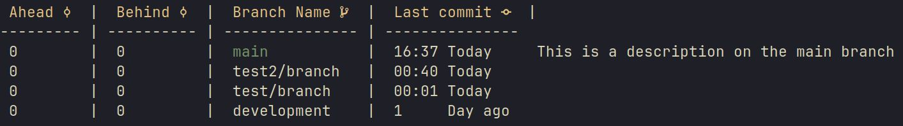

<p align="center"></p>
<h1 align="center">B-branch</h1>
<h3 align="center">A git branch tool extension to git, helping developers manage git branches</h3>

<div align="center">
  <hr/>
 &nbsp;&nbsp;
 &nbsp;&nbsp;
 
</div>


- [B-branch](#b-branch)
  - [Primise](#premise)
    - [Example](#example)
  - [Usage](#usage)
  - [Getting Started](#getting-started)
  - [Installation](#installation)
    - [Windows](#windows)
    - [Linux](#linux)
  - [Usage](#usage)
  - [Contributing](#contributing)
  - [Acknowledgments](#acknowledgments)
  - [License](#license)
  - [FQAs](#fqas)

## Premise 🚀
B-branch is a .NET-based application that enhances Git repository management via  a git alias. Inspired by **GitButlers** talk, [**So You Think You Know Git?** by Scott Chacon](https://www.youtube.com/watch?v=aolI_Rz0ZqY&t=472s), B-branch provides a structured view of branch information, simplifying workflows for developers.

The triditional git branch sorts branches alphabetically, making it difficult to identify the most recent branches. B-branch addresses this issue by providing a structured view of branch information, including the date of the last commit and the number of commits ahead or behind the upstream branch.

Cross-Platform Support: Built on .NET, **B-branch** runs on any platform supported by .NET 8.0, including Windows, Linux, and macOS.



### Example
Let's say you have a git repository with a lot of branches. You want to remove the branches that are no longer needed.

```sh
git bb --no-contains "main;development" -q \
| awk '{print substr($0, 3)}' \
| xargs -I {} git branch -D {}
```
`OBS!` This command will delete all branches that do not contain the strings "main" or "development". Be careful when using this command.

---

The ability to see the branch description is also a feature that is not available in the standard `git branch` command. To add a description to a branch, use the following command:

```sh
$ git bb --edit-description
```
Keep in mind that the description is stored in the `.git/EDIT_DESCRIPTION` and does not support a description on multiple branches.

## Usage

```sh
$ git bb [options]
```
### Options

- `-t, --track <String>`: Displays information about how many commits the specified branch is ahead or behind relative to its upstream branch.

- `-q, --quiet`: Only displays the names of the branches without any additional information or 
formatting.

- `-v, --version`: Shows the current version of the `B-branch` tool.

- `-s, --sort <String>`: Sorts the branches based on the specified criterion. Valid options are `[date]`, `[name]`, `[ahead]`, or `[behind]`.

- `-a, --all`: Displays all branches, both local and remote.

- `-n, --no-contains <String>`, `"String1;String2;..."`: Filters the list to only show branches that 
do not contain the specified string. Valid options are `<String>` OR `"String1;String2;..."`.

- `-c, --contains <String>`, `"String1;String2;..."`: Filters the list to only show branches that contain the specified string. Valid options are `<String>` OR `"String1;String2;..."`.

- `-r, --remote`: Includes remote branches in the output.

- `-h, --help`: Displays the help message with information about all available options.

- `-p, --print-top <Number>`: Prints the top N branches based on the specified sort criterion.

---

## Getting Started 🕹️

These instructions will get you a copy of the project up and running on your local machine for development and testing purposes.
Prerequisites

- git 2.39.2 or later

- .NET 8.0 SDK

- nerd-fonts 2.1.0 or later **(optional)**

## Installation

### Windows 🪟

1. Open powershell as an administrator and set the execution policy to `RemoteSigned`:
```sh
$ Set-ExecutionPolicy RemoteSigned
```

2. Clone the repository and navigate to the project directory:
```sh
$ git clone --depth 1 https://github.com/SimonNyvall/B-branch.git && cd B-branch/
```

3. Run the following command to install the project:
```sh
$ .\install.ps1
```

4. This will set an alias in the `.gitconfig` file to point to that executable. Run the script by running `git bb`

### Linux 🐧

1. Clone the repository and navigate to the project directory:
```sh
$ git clone --depth 1 https://github.com/SimonNyvall/B-branch.git
```

2. Run the following command to install the project:
```sh
$ ./install.sh
```

3. This will set an alias in the `.gitconfig` file to point to that executable. Run the script by running `git bb`

## Contributing 🖥️

We welcome contributions to **B-branch**! If you have suggestions or improvements, please fork the repo and create a pull request, or open an issue with the tag "enhancement". Don't forget to give the project a **star!** ⭐ Thanks again!

## Acknowledgments

This project was inspired by the innovative ideas shared by [**GitButler**](https://www.youtube.com/watch?v=aolI_Rz0ZqY&t=472s). Check out their video for more insights into enhancing Git workflows.

## License 📖

This project is licensed under the [MIT License](./LICENSE) - see the LICENSE.md file for details.

## FQAs

- **Q**: How do I add a description to a branch?
  - **A**: Use the following command: `git bb --edit-description`

- **Q**: Can I use this instead of the standard `git branch` command?
  - **A**: B-branch only helps developers view branch information. It does not replace the standard `git branch` command.

- **Q**: Will B-branch slow down git?
  - **A**: No, the extension works with an alias and does not affect the performance of git.

- **Q**: What is a common use case for B-branch?
  - **A**: A common use case I use is to check how many commits I am behind or ahead of the upstream main branch. To see if I need to pull or merge the changes. This can be done by running `git bb -t "origin/main"`.