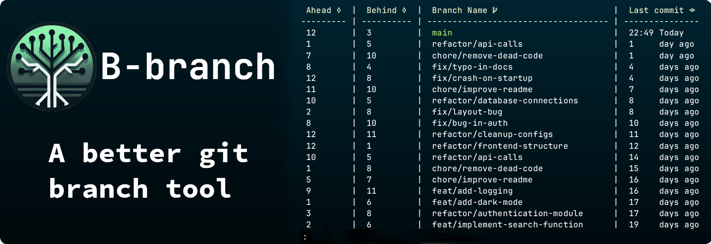

<p align="center"></p>
<h1 align="center">B-branch</h1>
<h3 align="center">A git extension for better branch management</h3>

<div align="center">
  <hr/>
 &nbsp;&nbsp;
 &nbsp;&nbsp;
 
</div>

- [Premise](#premise-rocket)
  - [Features](#features)
  - [Example](#example)
- [Usage](#usage)
  - [Options](#options)
- [Download](#download-computer)
- [Contributing](#contributing)
- [Acknowledgments](#acknowledgments-mega)
- [License](#license-book)
- [FQAs](#fqas)

## Premise :rocket:

B-branch is a tool that enhances Git branch management with a convenient git alias. Inspired by the talk [So You Think You Know Git? by Scott Chacon](https://www.youtube.com/watch?v=aolI_Rz0ZqY&t=472s), B-branch offers a more organized view of your branches, simplifying your workflow.

Traditional git branch commands sort branches alphabetically, making it hard to find recent ones. B-branch solves this by displaying branch information like the last commit date and commit differences with the upstream branch, all in a structured format.

Cross-Platform Support: B-branch runs on **Windows**, **Linux**, and **macOS** with no dependencies required when using the compiled executable. [Download](#download-computer) the latest release for **free**!



---

**key benefits**

- Quickly identify the branch you need.
- Access additional branch details not available with git branch.
- Enjoy reliable, high-performance, cross-platform support.

### Features

- **Branch information**: Displays the branch name, the date of the last commit, the number of commits ahead or behind the upstream branch, and the branch description.

- **Branch description**: Git offers the ability to add a description to a branch. B-branch displays this description in the output.

- **Pager interface**: If the output is too large to fit on the screen, the output will be displayed in a pager interface. While in the pager interface.
  - `q`: Quit the pager interface.
  - `j` OR `Down Arrow`: Move down one line.
  - `k` OR `Up Arrow`: Move up one line.
  - `f` OR `Space`: Move down one page.
  - `b`: Move up one page.
  - `g` OR `HOME`: Move to the top of the output.
  - `G` OR `END`: Move to the bottom of the output.
  - `/`: Search for a string in the output.
  - `Escape`: Clear the search.

### Example

Let's say you have a git repository with a lot of branches. You want to remove the branches that are no longer needed.

```sh
git bb --no-contains "main;development" -q \
| awk '{print substr($0, 3)}' \
| xargs -I {} git branch -D {}
```

> [!IMPORTANT]
> This command will delete all branches that do not contain the strings "main" or "development". Be careful when using this command.

---

The ability to see the branch description is also a feature that is not available in the standard `git branch` command. To add a description to a branch, use the following command:

```sh
git branch --edit-description
```

> [!NOTE]
> Keep in mind that the description is stored in the `.git/EDIT_DESCRIPTION` and does not support a description on multiple branches.

## Usage

```sh
git bb [<options>] [<additional arguments>]
```

### Options

#### Generic options:
| Flag                 | Description                                            |
|-------------------------|--------------------------------------------------------|
| `-h`, `--help`          | Show the help message.                                 |
| `-v`, `--version`       | Show the current version of the tool.                  |
| `-q`, `--quiet`         | Suppress additional output, showing only branch names. |

#### Filtering options:
| Flag                      | Description                                         |
|------------------------------|-----------------------------------------------------|
| `-c`, `--contains` <string>  | List branches containing the specified string.      |
| `-n`, `--no-contains` <string>| List branches not containing the specified string. |
| `-s`, `--sort` <criterion>   | Sort branches by `<date|name|ahead|behind>`.        |
| `-t`, `--track` <branch>     | Show upstream relationship of the specified branch. |
| `-a`, `--all`                | List both local and remote branches.                |
| `-r`, `--remote`             | List only remote branches.                          |
| `-p`, `--print-top` <N>      | Show the top N branches based on sort criterion.    |

#### Display options:
| Flag        | Description                             |
|----------------|----------------------------------------|
| `--pager`      | Force output to display in a pager.    |
| `--no-pager`   | Display output directly in the console.|

---

## Download :computer:
Download the latest release for free! If you're using **Cygwin**, **Git Bash**, **MSYS2**, **Bash** in linux or **WSL**, you can also use the install script:
```sh
curl -sSfL https://raw.githubusercontent.com/SimonNyvall/b-branch/main/install.sh | sh
```

For a manual installation, follow the steps in the [release](https://github.com/SimonNyvall/B-branch/releases) notes.

> [!NOTE]
> For full experience, download the latest version of the [nerd-fonts](https://www.nerdfonts.com/font-downloads) and install it on your system.

### Next Release
- `!command` to pager view to execute commands while in the pager.
- `n` key in pager to jump the next search result.
- `N` key in pager to jump to the previous search result.
- `h` key in pager to show the help message.
- .NET 9 upgrade.
- Multi-branch description support.

## Contributing

We welcome contributions to **B-branch**! If you have suggestions or improvements, please adhere to the following [guidelines](./CONTRIBUTE.md) when contributing to the project. Don't forget to give [the project](https://github.com/SimonNyvall/B-branch) a **star!** ⭐ Thanks again!

## Acknowledgments :mega:

This project was inspired by the innovative ideas shared by [**GitButler**](https://www.youtube.com/watch?v=aolI_Rz0ZqY&t=472s). Check out their video for more insights into enhancing Git workflows.

## License :book:

This project is licensed under the [GPL-3.0 License](./LICENSE) - see the LICENSE.md file for details.

## FQAs

- **Q**: How do I add a description to a branch?
  - **A**: Use the following command: `git branch --edit-description`

- **Q**: Can I use this instead of the standard `git branch` command?
  - **A**: B-branch only helps developers view branch information. It does not replace the standard `git branch` command.

- **Q**: Will B-branch slow down git?
  - **A**: No, the extension works with an alias and does not affect the performance of git.

- **Q**: What is a common use case for B-branch?
  - **A**: A common use case I use is to check how many commits I am behind or ahead of the upstream main branch. To see if I need to pull or merge the changes. This can be done by running `git bb -t "origin/main"`.
