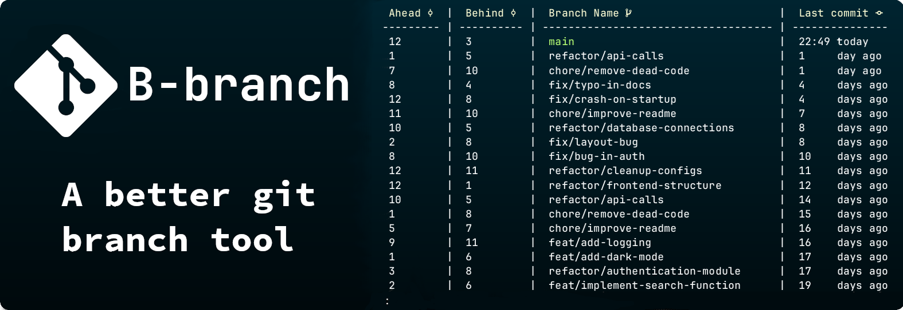
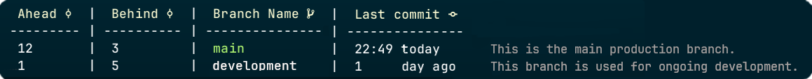

<p align="center"></p>
<h1 align="center">B-branch</h1>
<h3 align="center"> Git extension for better branch overview :wrench:</h3>
<p align="center"><strong>Download for</strong> macOS (<a href="https://github.com/SimonNyvall/B-branch/releases">Apple Silicon</a>) · Linux (<a href="https://github.com/SimonNyvall/B-branch/releases">x64</a>) · Windows (<a href="https://github.com/SimonNyvall/B-branch/releases">x64</a>)</p>

<div align="center">
  <hr/>
 &nbsp;&nbsp;
 &nbsp;&nbsp;
 &nbsp;&nbsp
 
</div>

<details>
<summary>Table of content</summary>

- [Premise](#premise-rocket)
  - [Features](#features)
  - [Example](#example)
- [Usage](#usage)
  - [Options](#options)
- [Download](#download-computer)
  - [Next Release](#next-release)
- [Contributing](#contributing)
- [Acknowledgments](#acknowledgments-mega)
- [License](#license-book)
- [FQAs](#fqas)

</details>

## Premise :rocket:

B-branch is a tool that enhances Git branch management with a convenient git alias. Inspired by the talk [So You Think You Know Git? by Scott Chacon](https://www.youtube.com/watch?v=aolI_Rz0ZqY&t=472s), B-branch offers a more organized view of your branches, simplifying your workflow.

Traditional git branch commands sort branches alphabetically, making it hard to find recent ones. B-branch solves this by displaying branch information like the last commit date and commit differences with the upstream branch, all in a structured format.

Cross-Platform Support: B-branch runs on **Windows**, **Linux**, and **macOS** with no dependencies required when using the compiled executable. [Download](#download-computer) the latest release for **free**!



---

**key benefits**

- Quickly identify the branch you need.
- Access additional branch details **not** available with `git branch`.
- Enjoy reliable, high-performance, cross-platform support.

### Features

- **Branch information**: Displays the branch name, the date of the last commit, the number of commits ahead or behind the upstream branch, and the branch descriptions.

- **Branch description**: Git offers the ability to add a description to a branch. B-branch displays this description in the output.

- **Pagination interface**: If the output is too large to fit on the screen, the output will be displayed in a pager interface. While in the pager interface.
  - `Down arrow`, `Enter`, `e` or `j`: Move forward one line.
  - `Up arrow`, `y` or `k`: Move backward onw line.
  - `Space bar` or `f`: Move forward one page.
  - `b`: Move backward one page.
  - `/pattern`: Search forward for matching patterns.
  - `?pattern`: Search backward for matching patterns.
  - `n`: Repeat previous search.
  - `N`: Repeat previous search in reverse direction.
  - `g`: Go to the first line in the file.
  - `Ng`: Go to the Nth line in the file.
  - `G`: Go to the last line in the file.
  - `p`: Go to the beginning of the file.
  - `Np`: Go to N percent into file.
  - `h`: Display help.
  - `q`: Exit less.

### Example

Explore and analyze your repository branches without making any changes.

For example, list your most recently updated branches, show only those related to a feature:

```sh
git bb --sort date --contains "feature" --print-top 10
```

---

#### Branch Descriptions

The ability to see the branch description is also a feature that is not available in the standard `git branch` command. To add a description to a branch, use the following command:

```sh
git branch --edit-description
```

You can define a description for each branch by including the branch name in square brackets (`[]`) followed by a short description on the next line.

``` text
[main]
This is the main production branch.

[development]
This branch is used for ongoing development.
```



## Usage

```sh
git bb [<options>] [<additional arguments>]
```

### Options

#### Generic options

| Flag                    | Description                                            |
|-------------------------|--------------------------------------------------------|
| `-h`, `--help`          | Show the help message.                                 |
| `-v`, `--version`       | Show the current version of the tool.                  |
| `-q`, `--quiet`         | Suppress additional output, showing only branch names. |

#### Filtering options

| Flag                           | Description                                         |
|--------------------------------|-----------------------------------------------------|
| `-c`, `--contains` <string>    | List branches containing the specified string.      |
| `-n`, `--no-contains` <string> | List branches not containing the specified string.  |
| `-s`, `--sort` <criterion>     | Sort branches by `<date|name|ahead|behind>`.        |
| `-t`, `--track` <branch>       | Show upstream relationship of the specified branch. |
| `-a`, `--all`                  | List both local and remote branches.                |
| `-r`, `--remote`               | List only remote branches.                          |
| `-p`, `--print-top` <N>        | Show the top N branches based on sort criterion.    |

---

## Installation :computer:

Install the latest release for free! If you're using **Cygwin**, **Git Bash**, **MSYS2**, **Bash** in linux or **WSL**, you can also use the install script:

```sh
curl -sSfL https://raw.githubusercontent.com/SimonNyvall/b-branch/main/install.sh | sh
```

>[!NOTE]
> The install script will also update the tool if it is already installed. If you want to install a specific version, you can use the `--version` flag:

```sh
curl -sSfL https://raw.githubusercontent.com/SimonNyvall/b-branch/main/install.sh | sh -s -- --version <version>
```

### Uninstall

If you want to uninstall the tool, you can run the following command:

```sh
curl -sSfL https://raw.githubusercontent.com/SimonNyvall/b-branch/main/uninstall.sh | sh
```

The install script will download the latest release and **install/update** the tool on your system.

For a manual installation, follow the steps in the [release](https://github.com/SimonNyvall/B-branch/releases) notes.

> [!NOTE]
> For full experience, download the latest version of the [nerd-fonts](https://www.nerdfonts.com/font-downloads) and install it on your system.
> If you already have a nerd font installed, you can run the following command to tell B-branch to display characters correctly:
>
> ```sh
> git config --global vars.useNerdFonts true
> ```

### Next Release

See the latest work being panned in the [issues](https://github.com/SimonNyvall/B-branch/issues).

## Contributing

We welcome contributions to **B-branch**! If you have suggestions or improvements, please adhere to the following [guidelines](./CONTRIBUTE.md) when contributing to the project. Don't forget to give [the project](https://github.com/SimonNyvall/B-branch) a **star!** ⭐ Thanks again!

## Acknowledgments :mega:

This project was inspired by the innovative ideas shared by [**GitButler**](https://www.youtube.com/watch?v=aolI_Rz0ZqY&t=472s). Check out their video for more insights into enhancing Git workflows.

## License :book:

This project is licensed under the [GPL-3.0 License](./LICENSE) - see the LICENSE.md file for details.

## FQAs

- **Q**: How do I add a description to a branch?
  - **A**: Use the following command: `git branch --edit-description`

- **Q**: Can I use this instead of the standard `git branch` command?
  - **A**: B-branch only helps developers view branch information. It does not replace the standard `git branch` command.

- **Q**: Why do I get the warning `Less command does not exist` when git bb is ran?
  - **A**: This means that the `less` command path has changed on your system, simply run the install scirpt again.

- **Q**: Will B-branch slow down git?
  - **A**: No, the extension works with an alias and does not affect the performance of git.

- **Q**: What is a common use case for B-branch?
  - **A**: A common use case I use is to check how many commits I am behind or ahead of the upstream main branch. To see if I need to pull or merge the changes. This can be done by running `git bb -t "origin/main"`.

- **Q**: Why does B-branch not show the date of the last commit sometimes?
  - **A**: This can happen if the branch has no commits or if the branch has no objects in the repository. A solution to this is to apply [git maintenance](https://git-scm.com/docs/git-maintenance) to the repository, to clean up and optimize the repository objects.
  
- **Q**: Why does it say `Blocked by Smart App` on `Windows`?
  - **A**: This is caused by Windows Smart App Control / SmartScreen, which may block unsigned or newly built executables that do not yet have a reputation. Since B-branch is distributed without a code-signing certificate, Windows may treat it as an unknown application. This is a Windows security feature and not an issue with the tool itself.

- **Q**: How do I turn off `Smart App`?
  - **A**: On `Windows 11` go to `Settings` -> `Privacy & security` -> `Windows Security` -> `App & browser control` -> `Smart App Control settings` -> `off`
